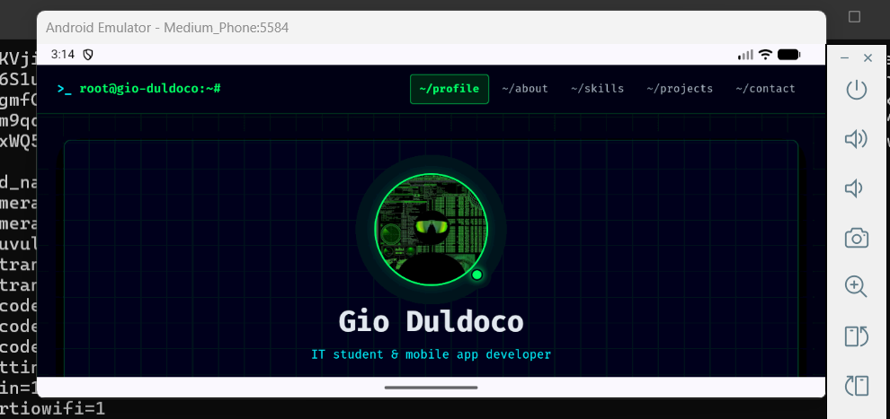
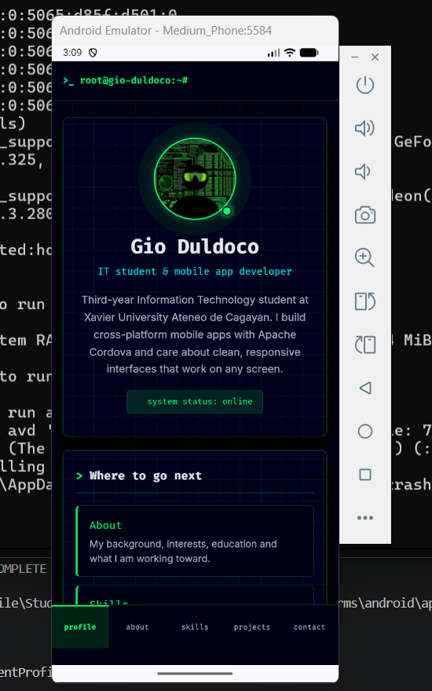
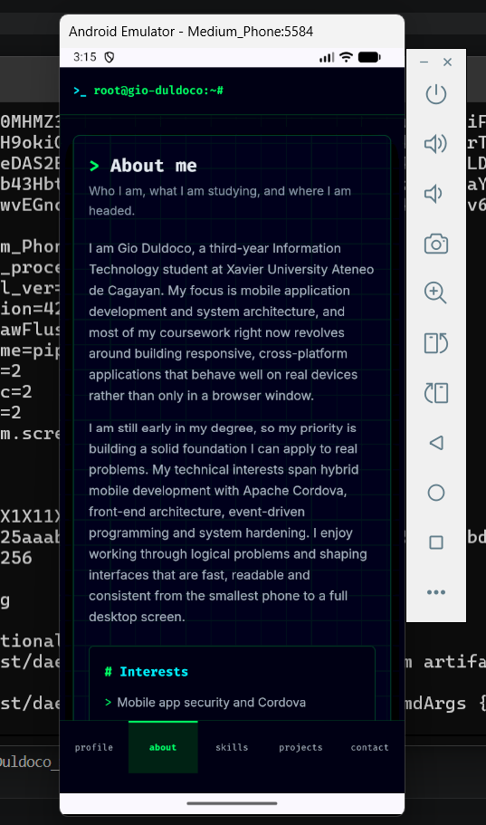
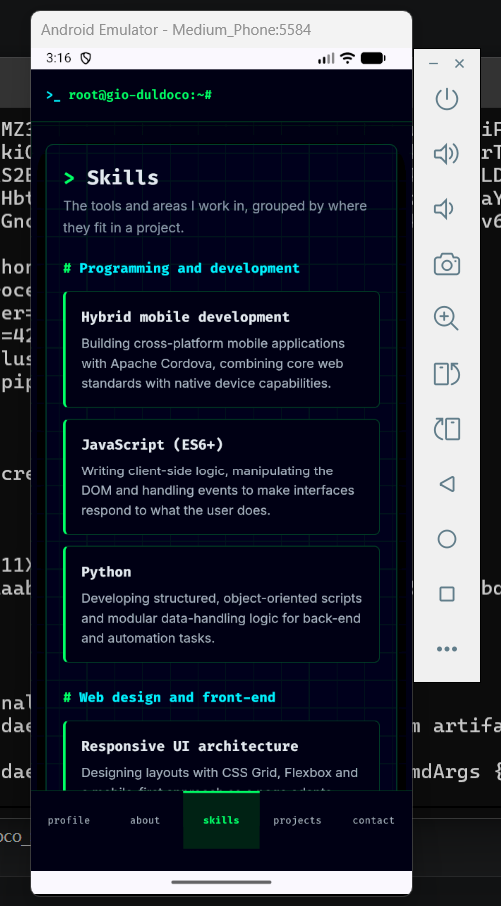
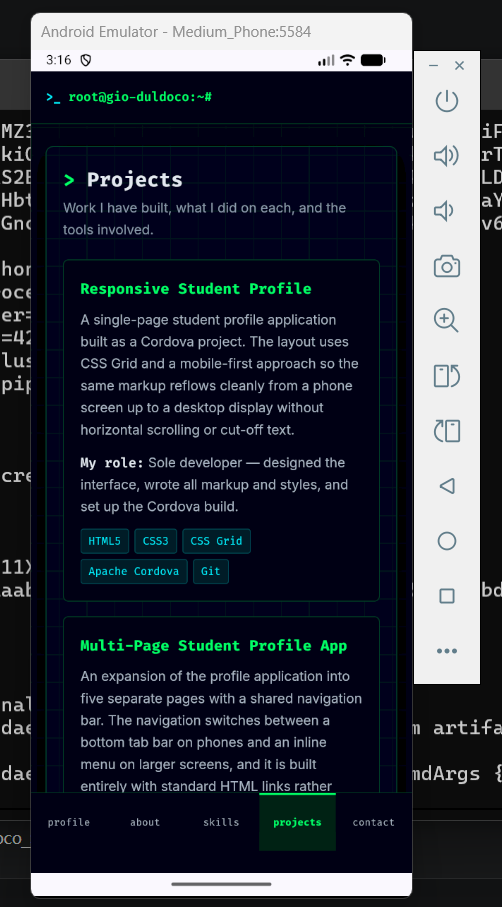
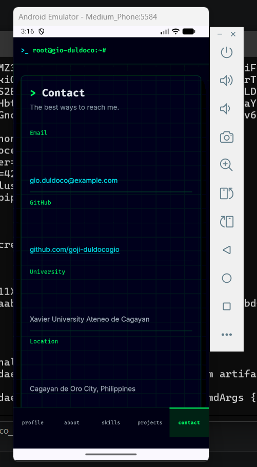

# Duldoco_StudentProfile

A responsive **multi-page** Student Profile application built with HTML, CSS and Apache Cordova.

This repository started as Activity 3 (a single-page responsive profile) and was expanded in
Activity 4 into five separate pages with shared interactive navigation.

## Pages

| Page | File | Purpose |
| --- | --- | --- |
| Profile (homepage) | `www/index.html` | Photo, name, tagline, short introduction and links to every other page |
| About | `www/about.html` | Personal introduction, interests, education and goals |
| Skills | `www/skills.html` | Technical skills grouped into three categories |
| Projects | `www/projects.html` | Three projects with role and technologies used |
| Contact | `www/contact.html` | Email, GitHub, professional profiles and a contact form layout |

## Project structure

```
Duldoco_StudentProfile/
├── config.xml
├── package.json
├── screenshots/
└── www/
    ├── index.html
    ├── about.html
    ├── skills.html
    ├── projects.html
    ├── contact.html
    ├── css/
    │   ├── main.css      # shared tokens, navigation, cards, footer
    │   └── pages.css     # page-specific blocks
    └── img/
```

## Navigation

Navigation uses standard HTML links only, no JavaScript is used for routing, page loading or
menu generation. The same navigation markup appears on all five pages. On screens under 700px it
renders as a fixed bottom tab bar; at 700px and above it moves into the top bar. The current page
is marked with `aria-current="page"` so users can always tell where they are.

## Responsive design

All five pages are responsive and were tested at three widths:

- Mobile — single column, bottom tab navigation
- Tablet (≥ 640px) — two-column grids for skills, about and page links
- Desktop (≥ 1000px) — three-column skills grid, wider spacing

## UI/UX Principles Applied

The UI/UX principles from Module 4 were applied across all five pages as follows.

User-centered design - The structure was decided by asking what a visitor needs rather than what I wanted to build. Someone landing on the profile page usually wants to know who I am and then jump to one specific thing, so the homepage gives a short introduction and then four clearly labelled entry points instead of forcing the visitor to scroll through everything.

Simplicity - Each page does one job. Splitting the single Activity 3 page into five pages removed the long scroll and reduced how much is on screen at once. There are no decorative extras, no unnecessary controls, and the only actions available are navigation links — which keeps the number of possible actions per screen low.

Consistency - Every page uses the same header, the same navigation, the same footer, the same colour scheme, the same two typefaces (Fira Code for headings and interface text, Inter for body text) and the same card and panel components. This is enforced in code: main.css holds the shared styles and design tokens, and every page loads it, so a change applies everywhere at once. A user who learns one page already knows how the other four work.

Visual hierarch - Size, colour, position and spacing are used to signal what matters most. Page titles are the largest text and use the accent green marker; section headings sit below them in cyan; supporting body text is smaller and in a dimmer grey. On the homepage the profile photo and name are the first thing seen, which establishes what the app is about before anything else.

Feedback - Since this project didn't use JavaScript, feedback is handled through CSS states. Links change colour and background on hover and on focus, form fields highlight their border when active, and the current page is permanently marked in the navigation so the user always knows where they are. The user can also send a message to the person.

Readability and accessibility. Body text is set at 16px with a line height of 1.65 and body paragraphs are limited to about 68 characters per line so they stay comfortable to read. All text colours were checked against the dark background: the lowest ratio in the app is 6.9:1, above the 4.5:1 WCAG AA minimum. Beyond contrast, the application uses semantic headings in order, descriptive alternative text on every image, labels attached to every form field, a visible keyboard focus outline, a skip-to-content link, and a prefers-reduced-motion rule that disables animation for users who ask for it.

## Running the app

```bash
npm install
cordova platform add android
cordova build android
cordova run android
```

To preview quickly in a browser:

```bash
cordova platform add browser
cordova run browser
```

## Screenshots

### Desktop Layout


### Tablet Layout


### Mobile Layout


### Profile 


### About Me


### Skills


### Projects


### Contact


## Cordova Application Requirements

### Rotation


### Mobile Profile


### Mobile About


### Mobile Skills


### Mobile Projects


### Mobile Contact



