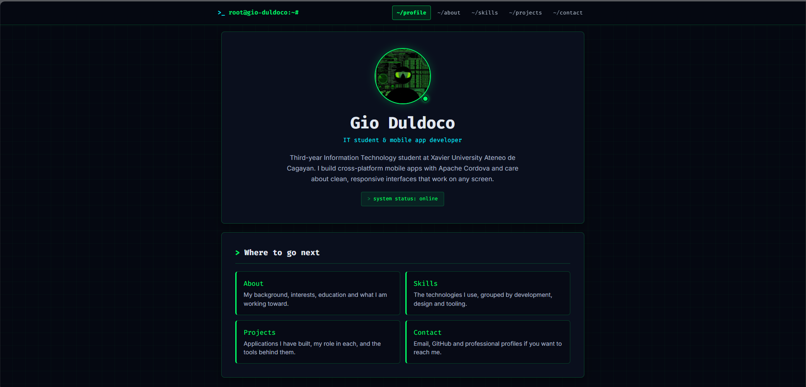
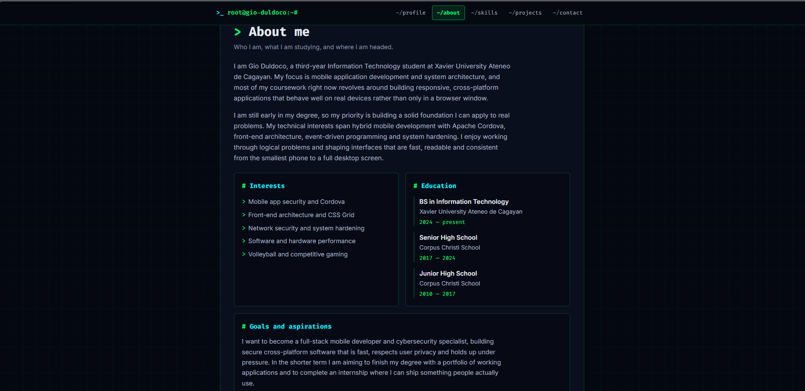
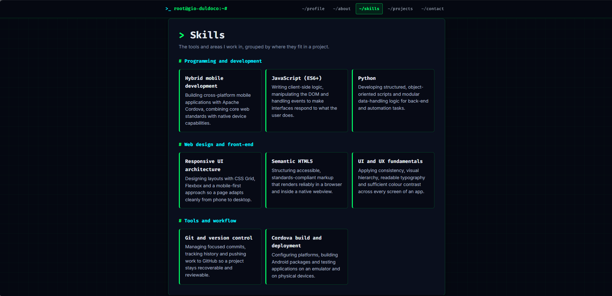
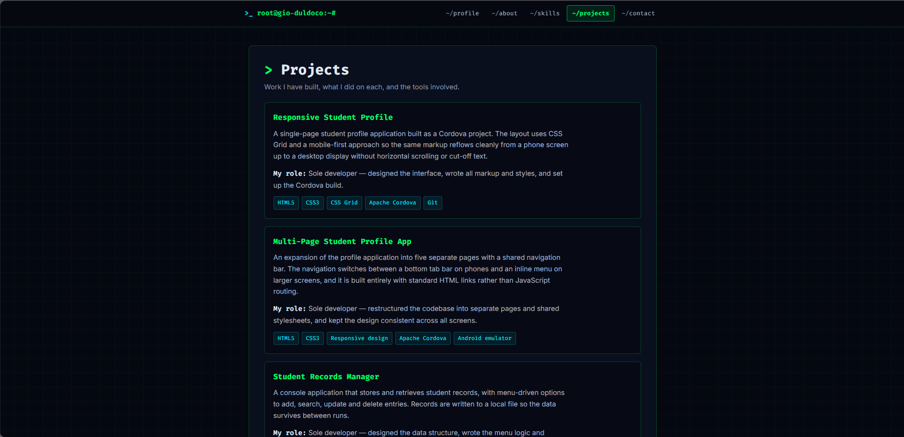
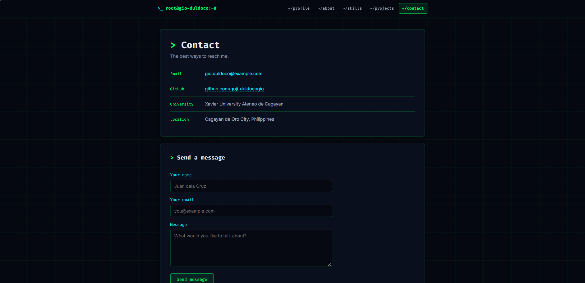
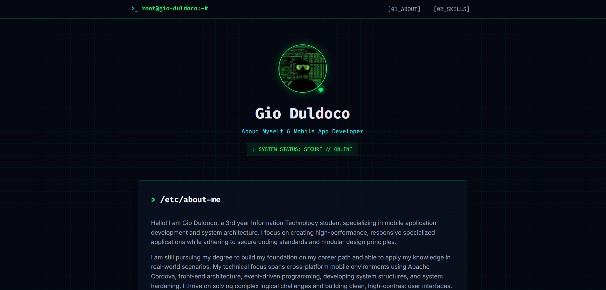
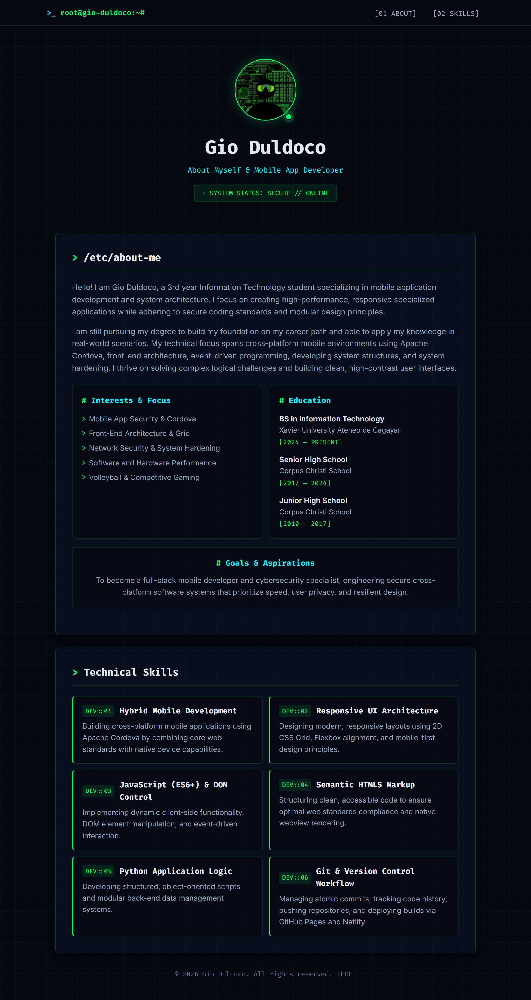
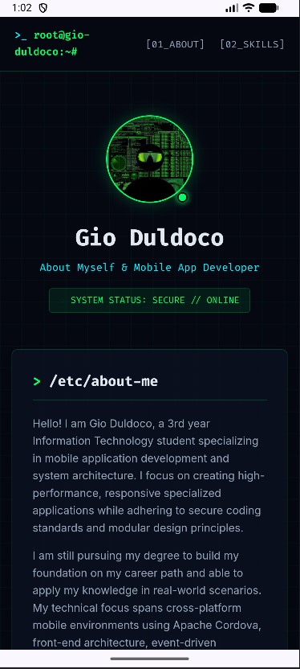

# Duldoco_StudentProfile

## 1. Project Description

A multi-page Student Profile application built with HTML, CSS and Apache Cordova.

The application presents my personal and academic information as a small mobile app. It started in
Activity 3 as a single responsive page and was reorganised in Activity 4 into five separate pages
connected by a shared navigation bar. It runs as a native Android application through Cordova and
uses no JavaScript — all navigation is handled with standard HTML links.

## 2. Application Pages

| Page | File | Purpose |
| --- | --- | --- |
| **Profile** | `www/index.html` | The homepage and main entry point. Shows my photo, name, tagline and a short introduction, then links out to the four other sections so a visitor can see at a glance what the app contains. |
| **About** | `www/about.html` | The detailed personal section. Contains two paragraphs introducing myself, plus panels for my interests, my educational background and my goals and aspirations. |
| **Skills** | `www/skills.html` | Lists my technical skills with a short description of each, organised into three categories: programming and development, web design and front-end, and tools and workflow. |
| **Projects** | `www/projects.html` | Showcases three projects I have worked on. Each entry gives the project title, a short description, my role or contribution, and the technologies used. |
| **Contact** | `www/contact.html` | Contains my contact information — email, GitHub, professional profile, university and location — along with a contact form layout. The form is a layout preview only and is not functional in this activity. |

## 3. Navigation

Navigation is implemented entirely with **standard HTML links** (`<a href="about.html">`). No
JavaScript is used to load pages, generate the menu or handle routing.

The same navigation markup appears on all five pages, so a user can move directly from any page to
any other page without going through the homepage first:

```
Profile ←→ About ←→ Skills ←→ Projects ←→ Contact
```

There are three separate ways to get back to the homepage from any page:

1. The **Profile** item in the navigation bar
2. The **`>_ root@gio-duldoco:~#`** brand in the header, which is a link to `index.html`
3. The **Back to profile** button in the footer

The link for the page you are currently on is marked with `aria-current="page"`. It is highlighted
in green with a coloured edge, so the user can always tell which section they are in.

## 4. Responsive Design

All five pages are responsive, not just the homepage. The layout was built mobile-first — the base
CSS targets the smallest screen and media queries add complexity as the screen grows.

| Screen | Width | Layout |
| --- | --- | --- |
| **Mobile** | under 640px | Single-column content. Navigation sits at the bottom of the screen as a fixed tab bar, within easy thumb reach. |
| **Tablet** | 640px and above | Skills, page links and the About panels move to two columns. At 700px the navigation moves up into the top bar. |
| **Desktop** | 1000px and above | Skills expand to three columns, spacing and type sizes increase, content is capped at 900px so lines stay readable. |

The pages were checked at 320px, 360px, 768px, 1280px and 1440px. At every width there is no
horizontal scrolling, no overlapping elements, no cut-off text and no broken navigation. Long values
such as email addresses and URLs are set to wrap rather than push the layout sideways.

## 5. UI/UX Principles Applied

The UI/UX principles from Module 4 were applied across all five pages as follows.

**User-centered design.** The structure was decided by asking what a visitor needs rather than what
I wanted to build. Someone landing on the profile page usually wants to know who I am and then jump
to one specific thing, so the homepage gives a short introduction and then four clearly labelled
entry points instead of forcing the visitor to scroll through everything.

**Simplicity.** Each page does one job. Splitting the single Activity 3 page into five pages removed
the long scroll and reduced how much is on screen at once. There are no decorative extras, no
unnecessary controls, and the only actions available are navigation links — which keeps the number
of possible actions per screen low.

**Consistency.** Every page uses the same header, the same navigation, the same footer, the same
colour scheme, the same two typefaces (Fira Code for headings and interface text, Inter for body
text) and the same card and panel components. This is enforced in code: `main.css` holds the shared
styles and design tokens, and every page loads it, so a change applies everywhere at once. A user who
learns one page already knows how the other four work.

**Visual hierarchy.** Size, colour, position and spacing are used to signal what matters most. Page
titles are the largest text and use the accent green marker; section headings sit below them in cyan;
supporting body text is smaller and in a dimmer grey. On the homepage the profile photo and name are
the first thing seen, which establishes what the app is about before anything else.

**Feedback.** Since this activity uses no JavaScript, feedback is handled through CSS states. Links
change colour and background on hover and on focus, form fields highlight their border when active,
and the current page is permanently marked in the navigation so the user always knows where they
are. Buttons and links visibly respond to being interacted with rather than staying static.

**Readability and accessibility.** Body text is set at 16px with a line height of 1.65 and body
paragraphs are limited to about 68 characters per line so they stay comfortable to read. All text
colours were checked against the dark background: the lowest ratio in the app is 6.9:1, above the
4.5:1 WCAG AA minimum. Beyond contrast, the application uses semantic headings in order, descriptive
alternative text on every image, labels attached to every form field, a visible keyboard focus
outline, a skip-to-content link, and a `prefers-reduced-motion` rule that disables animation for
users who ask for it.

## 6. How to Run

### Requirements

- Node.js 20.17.0 or later
- Java JDK 17
- Android Studio with SDK Platform 36 and Build Tools 36.0.0
- `JAVA_HOME` and `ANDROID_HOME` environment variables set
- Apache Cordova CLI (`npm install -g cordova`)

### Build and run on Android

```bash
# 1. Install project dependencies
npm install

# 2. Add the Android platform
cordova platform add android

# 3. Confirm the environment is ready
cordova requirements

# 4. Build the application
cordova build android

# 5. Run on a started emulator or connected device
cordova run android
```

### Preview in a browser

```bash
cordova platform add browser
cordova run browser
```

## 7. Application Screenshots

### Profile (Homepage)


### About


### Skills


### Projects


### Contact


### Responsive Layouts

| Desktop | Tablet | Mobile |
| --- | --- | --- |
|  |  |  |

### Running on the Android Emulator

