# Student Profile Application

## 1. Project Description
The **Student Profile Application** is a responsive, terminal-themed hybrid mobile application built using HTML5, CSS3, JavaScript, and Apache Cordova. It showcases student information, skills, portfolio projects, and personal details while supporting live profile updates using device hardware capabilities.

---

## 2. Application Pages
The application consists of five primary navigation screens:
* **Profile:** Displays the main student profile card, avatar, current system status, quick skills summary, and navigation links.
* **About:** Outlines academic background, personal interests, hobbies, and career goals.
* **Skills:** Presents categorized technical proficiencies, including programming languages, design tools, and utilities.
* **Projects:** Features built applications, technologies utilized, and project roles.
* **Contact:** Contains direct contact information, social links, and an interactive messaging form.

---

## 3. Profile Editing
The application features an interactive **Edit Profile** modal (`edit_profile.sh`). Users can update their name, course, year level, bio, and skills in real time. 
* All profile data is serialized into JSON format.
* Data is stored locally in the browser's `localStorage` key (`studentProfile`).
* Changes persist across app restarts and reloads without needing an external database.

---

## 4. Camera Integration
Profile pictures can be captured directly through native mobile camera hardware using the `cordova-plugin-camera` plugin.

**Process Flow:**
$$\text{Change Profile Picture} \longrightarrow \text{Open Camera} \longrightarrow \text{Capture Image} \longrightarrow \text{Update Profile Picture}$$

1. The user clicks **`> Take Photo`** inside the profile editing modal.
2. The application triggers `navigator.camera.getPicture()`.
3. The native device camera interface launches.
4. After capturing and approving the snapshot, the photo data is passed back to JavaScript.
5. The circular avatar preview instantly updates with the new image.

---

## 5. Device Feature Integration
Apache Cordova is required because standard WebViews inside mobile apps cannot directly invoke native device hardware (such as camera lenses) or manage system-level runtime permissions. Cordova acts as a native bridge (`cordova.exec`), allowing JavaScript calls to execute Android `CameraLauncher` Intents (`MediaStore.ACTION_IMAGE_CAPTURE`).

---

## 6. Image Handling
* **Format:** Captured photos are returned from native Java code as Base64-encoded JPEG strings (`DATA_URL`).
* **Display:** The base64 string is assigned directly to the `src` attribute of the avatar `` DOM elements (`data:image/jpeg;base64,...`).
* **Persistence:** The Base64 string is saved to `localStorage` alongside profile text details, allowing custom profile photos to load automatically upon launching the application.

---

## 7. Error Handling
The application includes robust error and edge-case handling within the camera error callback:
* **Camera Permission Denial:** If the user denies camera permissions, an onscreen alert message (`[ERR] Camera permission denied`) instructs the user to enable camera access in system settings.
* **Camera Cancellation:** If the user closes or cancels the camera interface without taking a photo, the error callback detects the cancellation string (`camera cancelled` / `no image selected`) and exits gracefully without altering or clearing the existing profile picture.
* **Camera Errors:** Hardware crashes, device incompatibility, or missing cameras are caught in a `try...catch` block and display user-friendly error messages on screen.

---

## 8. Responsive Design
The application layout adapts seamlessly across screen dimensions:
* **Mobile (< 600px):** Single-column layout with a bottom navigation bar for quick thumb navigation.
* **Tablet (600px – 899px):** Two-column grid layouts for page links and skills sections with expanded padding.
* **Desktop ($\ge$ 900px):** Top navigation bar display, fixed-width centered main container (`900px`), and side-by-side content alignment.

---

## 9. How to Run

### Install Dependencies
* Install [Node.js](https://nodejs.org/) (v16 or higher).
* Install Apache Cordova CLI globally:
  ```bash
  npm install -g cordova

## 10. Application Screenshots

### Profile (Homepage)
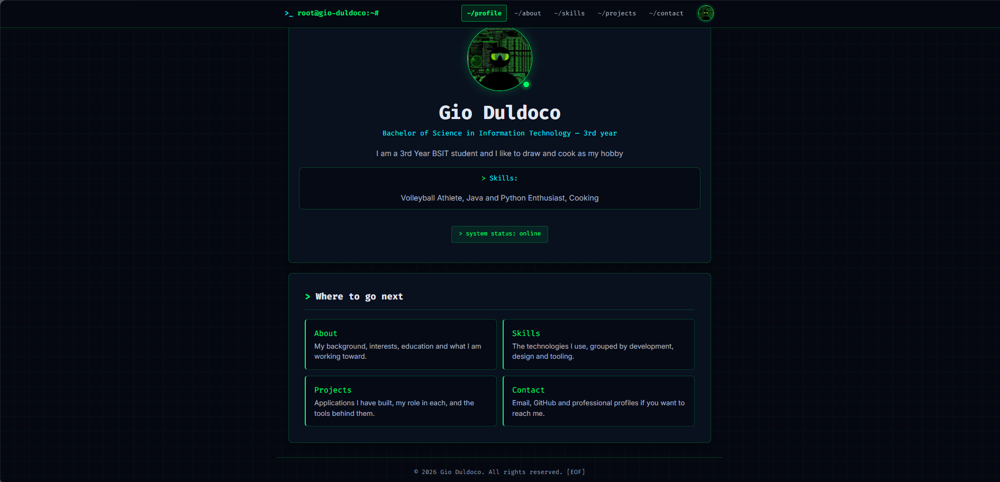

### About
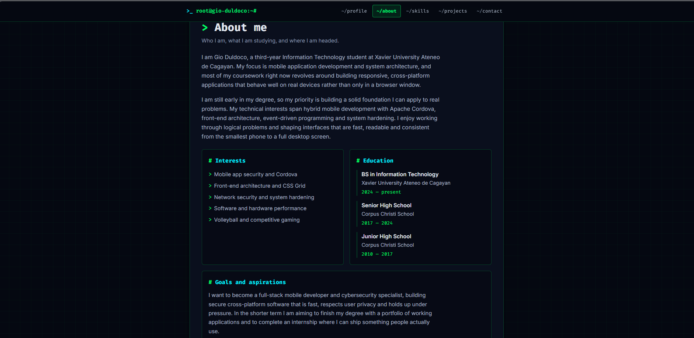

### Skills
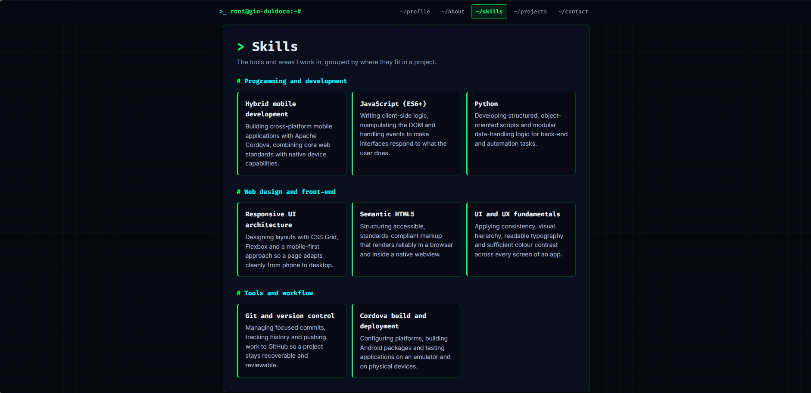

### Projects
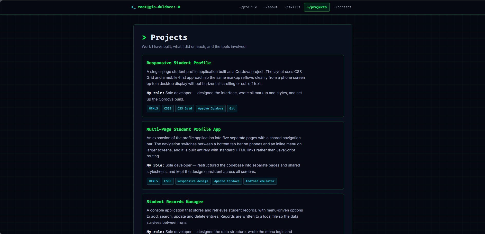

### Contact
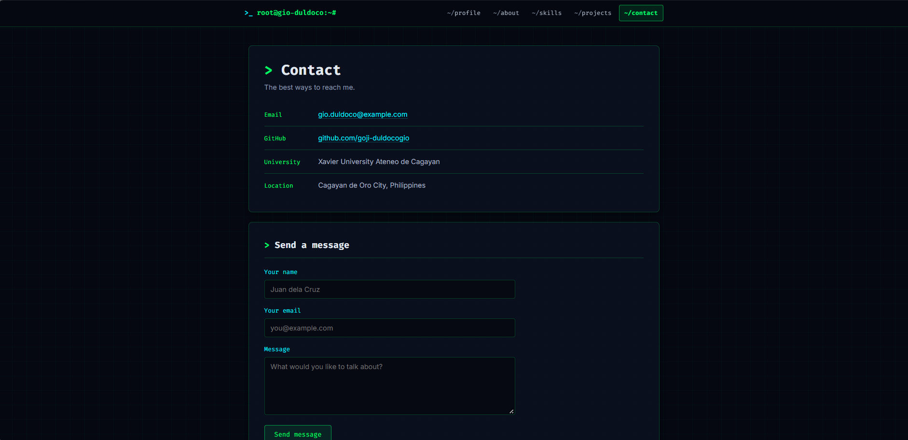

### Responsive Layouts

| Desktop | Tablet | Mobile |
| --- | --- | --- |
| 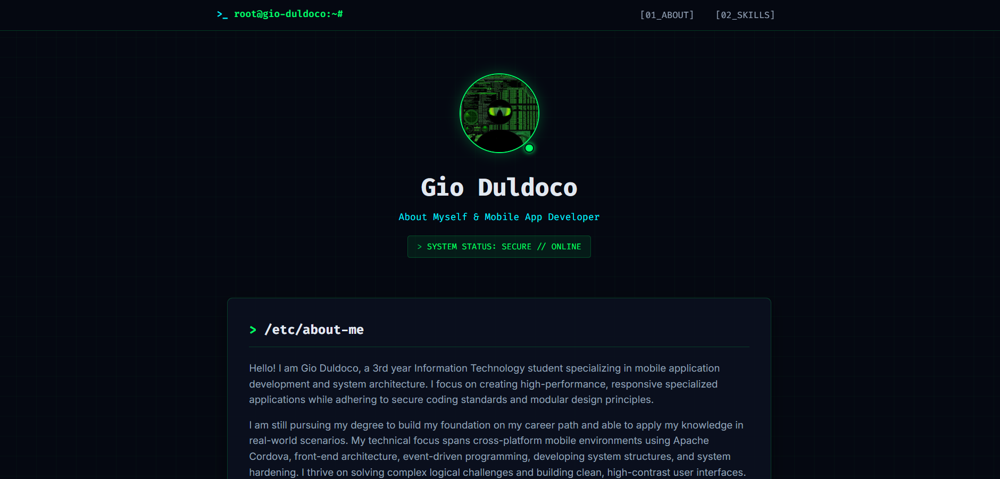 | 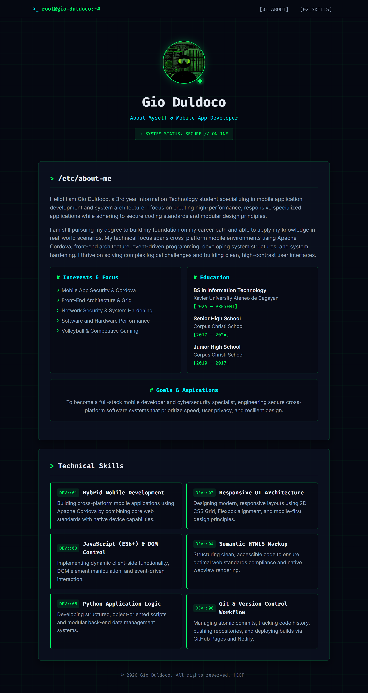 | 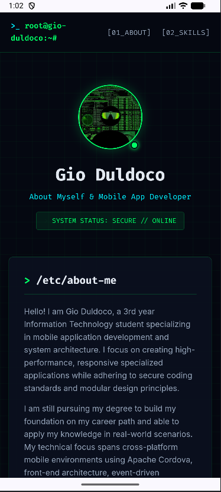 |

# Edit and Update Profile

### Edit Profile
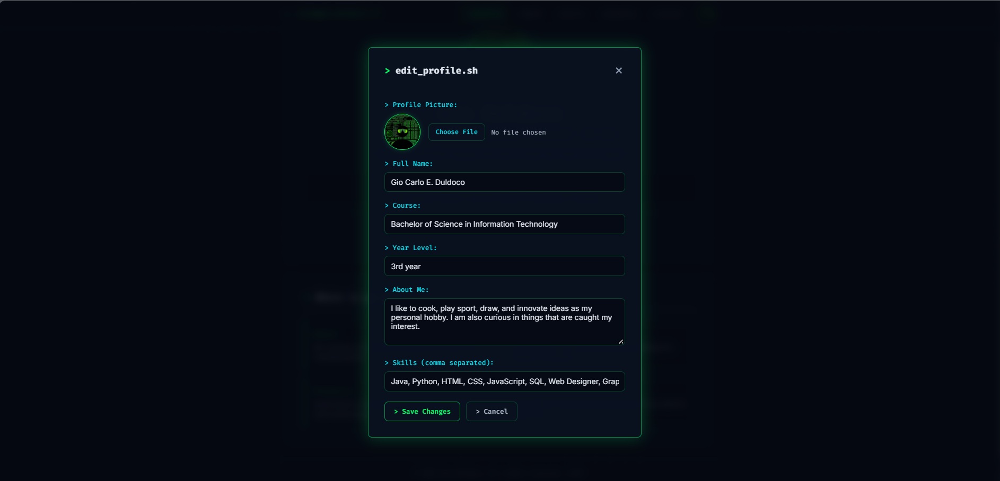

### Update Profile
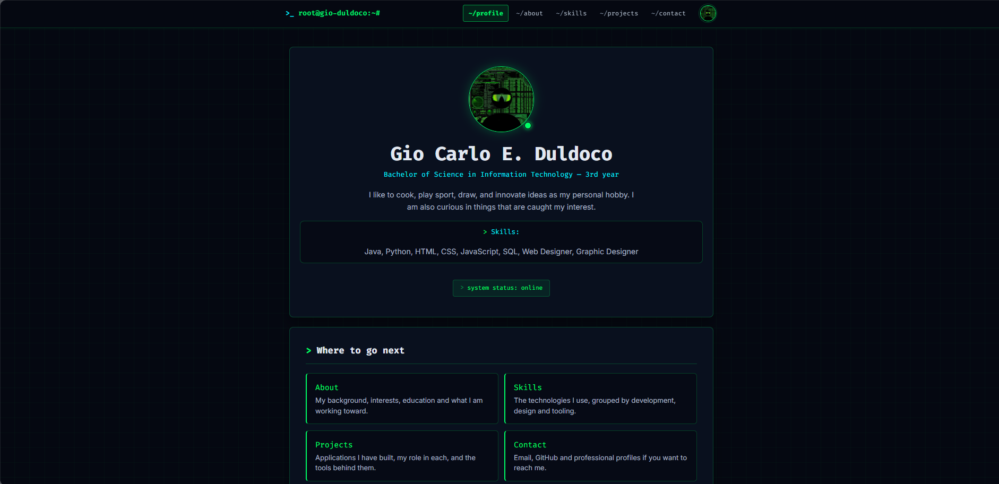

## Cordova Application Screenshot

### Cordova Student Profile
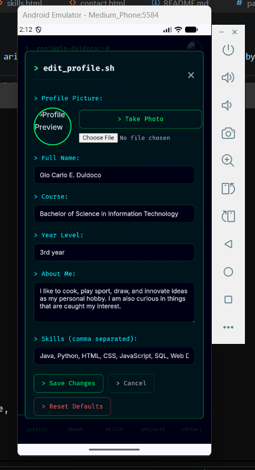

### Changed Profile Picture
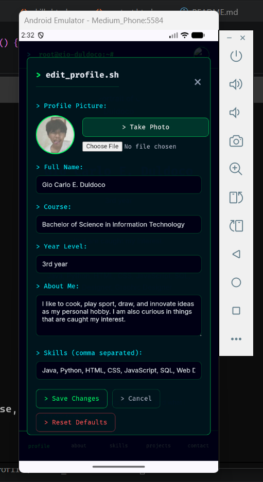

### Capture Image
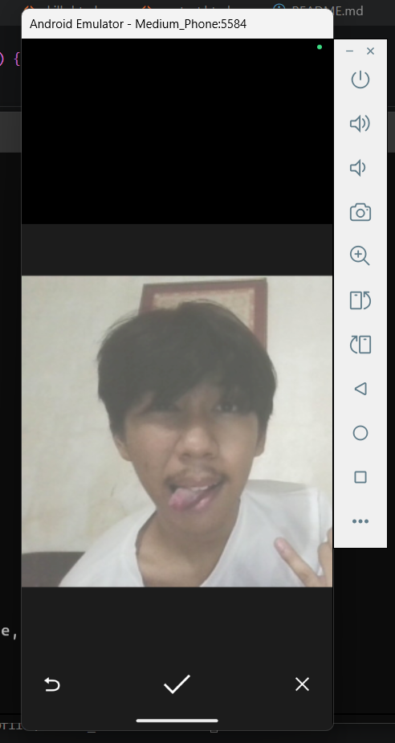

### Cordova Updated Profile
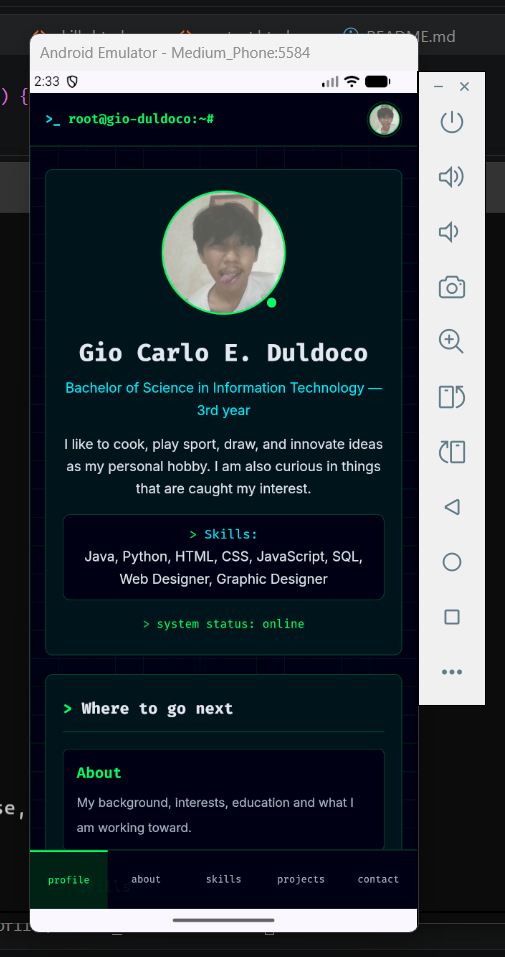


